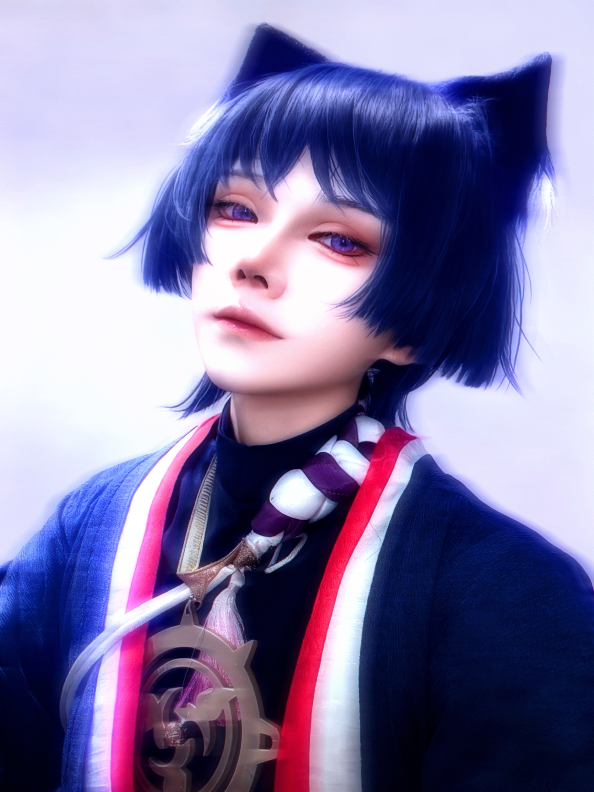

## Practice-based Research in Japanese Subculture and ACG Culture

My research on Japanese subculture and ACG (Animation, Comics, Games) culture is grounded not only in textual and theoretical analysis, but also in sustained practice-based research. I employ embodied, performative, and platform-mediated cultural practices as methodological tools to examine how Japanese ACG culture is experienced, reproduced, and recontextualized across transnational contexts.

Cosplay constitutes a core component of this practice-based approach. Rather than treating cosplay as a hobby or auxiliary activity, I conceptualize it as an embodied research practice through which fictional characters are materialized, interpreted, and performed. Through costume production, character embodiment, performative posture, and participation in fan events, cosplay enables an examination of identity performance, gender expression, fan labor, and affective engagement within Japanese subcultural spaces. This embodied engagement provides insights into how ACG characters function as cultural interfaces between media texts, bodies, and audiences.

This embodied practice is further integrated with my research on digital and platform cultures through sustained activity as a virtual streamer (V-Tuber) on the Chinese video-sharing platform Bilibili.

---

## Visual Documentation (Selected)

<!-- Cosplay 01 -->
<figure class="research-figure">
  
  <figcaption>
    <strong>Figure 1.</strong>
    Embodied interpretation of a Japanese ACG character through costume design and performative posture, illustrating cosplay as an embodied research practice.
  </figcaption>
  

    <strong>Character portrayed:</strong> Scaramouche (from <em>Genshin Impact</em>) 
    <strong>キャラクター：</strong> 散兵（『原神』）
  

</figure>

<!-- Cosplay 02 -->
<figure class="research-figure">
  
  <figcaption>
    <strong>Figure 2.</strong>
    Character embodiment and pose-based performance in offline fan events, highlighting identity performance within Japanese subcultural contexts.
  </figcaption>
  

    <strong>Character portrayed:</strong> Satoru Gojo (from <em>Jujutsu Kaisen</em>) 
    <strong>キャラクター：</strong> 五条悟（『呪術廻戦』）
  

</figure>

<!-- Cosplay 03 -->
<figure class="research-figure">
  
  <figcaption>
    <strong>Figure 3.</strong>
    Public presentation of ACG characters as materialized cultural figures, emphasizing fan labor and affective engagement.
  </figcaption>
  

    <strong>Character portrayed:</strong> Fern (from <em>Frieren: Beyond Journey’s End</em>) 
    <strong>キャラクター：</strong> フェルン（『葬送のフリーレン』）
  

</figure>

<!-- Anime Song Performance -->
<figure class="research-figure">
  
  <figcaption>
    <strong>Figure 4.</strong>
    Performance-based engagement with Japanese anime music as an affective and auditory mode of participation within ACG culture.
  </figcaption>
  

    <strong>Song performed:</strong> “Secret Base ~Kimi ga Kureta Mono~”, theme song of <em>Anohana: The Flower We Saw That Day</em> 
    <strong>楽曲：</strong>「Secret Base ～君がくれたもの～」（『あの日見た花の名前を僕達はまだ知らない。』主題歌）
  

</figure>
